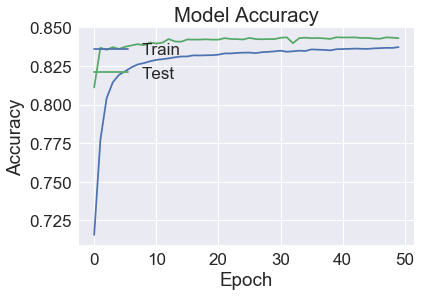

### Nicola Sebastianelli & Robin Bürgi
<br><br>

# Project Report - Predicting Skill Level of Player based on Actions
#### Using Recorded Matches of Counter Strike: Global Offensive Games to Predict the Skill Level of New Players
<br><br>

## - Business Understanding:

The goal of this project is to predict the skill level of a player in the online multiplayer game Counter-Strike: Global Offensive or CS:GO in short.
This game is a round based first person shooter that is played on a 5 players against 5 players basis. When a player is looking for a new match, the game tries to find teammates that are of similar skill level to provide a fun and challenging experience.

Players that are new to the game don't have yet an assigned skill level.
To provide the best gameplay for new players it is necessary to determine their rank quickly so that they are matched against opponents of equal skill. This is the problem that this analysis tries to tackle. A classification model should be created that allows to determine the rank of a player based only on a few actions.

The analysis is based on an open source dataset on Kaggle. The dataset contains over a million instances of gameplay actions from different players and their according rank. The dataset can be found here: https://www.kaggle.com/skihikingkevin/csgo-matchmaking-damage .
<br><br>

## - Data Exploration:

The dataset is composed of about 1 million entries and 33 attributes, initially we are going to remove some of the attributes that are useless for our aim and then we are going to make some test to the remaining attributes to select the more significative ones.

```python
import math
import pandas as pd
from sklearn import neighbors, datasets , preprocessing,svm
from sklearn.metrics import accuracy_score ,classification_report,
confusion_matrix
from sklearn.utils import shuffle
from sklearn.model_selection import StratifiedShuffleSplit,
cross_val_score, train_test_split
from sklearn.multiclass import OneVsRestClassifier
import matplotlib.pyplot as plt
import seaborn as sn
import numpy as np
```


```python
df = pd.read_csv('mm_master_demos.csv') # Read the DataSet

# Removing not used attributes
del df['Unnamed: 0']
del df['file']
del df['date']
del df['seconds']
del df['att_team']
del df['att_side']
del df['vic_team']
del df['vic_side']
del df['winner_team']
del df['winner_side']
del df['att_id']
del df['vic_id']
del df['award']
del df['is_bomb_planted']
del df['bomb_site']


data=df.copy() # Creating a working copy of the original DataSet
data=shuffle(data) # Randomizing the DataSet
data # Printing the DataSet
```


<div>
<style scoped>
    .dataframe tbody tr th:only-of-type {
        vertical-align: middle;
    }

    .dataframe tbody tr th {
        vertical-align: top;
    }

    .dataframe thead th {
        text-align: right;
    }
</style>
<table border="1" class="dataframe">
  <thead>
    <tr style="text-align: right;">
      <th></th>
      <th>map</th>
      <th>round</th>
      <th>tick</th>
      <th>hp_dmg</th>
      <th>arm_dmg</th>
      <th>hitbox</th>
      <th>wp</th>
      <th>wp_type</th>
      <th>att_rank</th>
      <th>vic_rank</th>
      <th>att_pos_x</th>
      <th>att_pos_y</th>
      <th>vic_pos_x</th>
      <th>vic_pos_y</th>
      <th>round_type</th>
      <th>ct_eq_val</th>
      <th>t_eq_val</th>
      <th>avg_match_rank</th>
    </tr>
  </thead>
  <tbody>
    <tr>
      <th>618791</th>
      <td>de_cache</td>
      <td>17</td>
      <td>107432</td>
      <td>15</td>
      <td>5</td>
      <td>Chest</td>
      <td>Mac10</td>
      <td>SMG</td>
      <td>11</td>
      <td>11</td>
      <td>-840.891500</td>
      <td>-343.00980</td>
      <td>-647.06220</td>
      <td>-216.326900</td>
      <td>SEMI_ECO</td>
      <td>5750</td>
      <td>15000</td>
      <td>9.0</td>
    </tr>
    <tr>
      <th>947890</th>
      <td>de_cbble</td>
      <td>15</td>
      <td>92860</td>
      <td>27</td>
      <td>5</td>
      <td>Stomach</td>
      <td>M4A4</td>
      <td>Rifle</td>
      <td>12</td>
      <td>11</td>
      <td>-2787.051000</td>
      <td>737.30150</td>
      <td>-2560.70200</td>
      <td>1284.525000</td>
      <td>NORMAL</td>
      <td>20200</td>
      <td>28550</td>
      <td>11.0</td>
    </tr>
    <tr>
      <th>160767</th>
      <td>de_mirage</td>
      <td>1</td>
      <td>11603</td>
      <td>13</td>
      <td>7</td>
      <td>Stomach</td>
      <td>Glock</td>
      <td>Pistol</td>
      <td>9</td>
      <td>10</td>
      <td>-114.612300</td>
      <td>-2372.78300</td>
      <td>-76.32249</td>
      <td>-1552.389000</td>
      <td>PISTOL_ROUND</td>
      <td>4250</td>
      <td>3100</td>
      <td>9.0</td>
    </tr>
    <tr>
      <th>308813</th>
      <td>de_dust2</td>
      <td>13</td>
      <td>99666</td>
      <td>26</td>
      <td>1</td>
      <td>RightArm</td>
      <td>FiveSeven</td>
      <td>Pistol</td>
      <td>14</td>
      <td>14</td>
      <td>-1004.205000</td>
      <td>1468.71400</td>
      <td>-1062.35500</td>
      <td>1241.170000</td>
      <td>ECO</td>
      <td>10100</td>
      <td>30750</td>
      <td>13.0</td>
    </tr>
    <tr>
      <th>254760</th>
      <td>de_mirage</td>
      <td>5</td>
      <td>30279</td>
      <td>22</td>
      <td>4</td>
      <td>Chest</td>
      <td>M4A1</td>
      <td>Rifle</td>
      <td>10</td>
      <td>8</td>
      <td>-533.808700</td>
      <td>-1503.19100</td>
      <td>-216.83830</td>
      <td>-1574.362000</td>
      <td>NORMAL</td>
      <td>31250</td>
      <td>21200</td>
      <td>8.0</td>
    </tr>
    <tr>
      <th>96578</th>
      <td>de_cache</td>
      <td>1</td>
      <td>7555</td>
      <td>100</td>
      <td>0</td>
      <td>Head</td>
      <td>USP</td>
      <td>Pistol</td>
      <td>12</td>
      <td>12</td>
      <td>387.891400</td>
      <td>-809.67990</td>
      <td>977.90610</td>
      <td>-1000.685000</td>
      <td>PISTOL_ROUND</td>
      <td>4150</td>
      <td>4250</td>
      <td>11.0</td>
    </tr>
    <tr>
      <th>926397</th>
      <td>de_dust2</td>
      <td>20</td>
      <td>113052</td>
      <td>7</td>
      <td>0</td>
      <td>Generic</td>
      <td>Incendiary</td>
      <td>Grenade</td>
      <td>11</td>
      <td>11</td>
      <td>1338.091000</td>
      <td>2186.14400</td>
      <td>1338.09100</td>
      <td>2186.144000</td>
      <td>NORMAL</td>
      <td>28700</td>
      <td>18900</td>
      <td>10.0</td>
    </tr>
    <tr>
      <th>186785</th>
      <td>de_cache</td>
      <td>24</td>
      <td>152884</td>
      <td>9</td>
      <td>0</td>
      <td>LeftArm</td>
      <td>SG556</td>
      <td>Rifle</td>
      <td>9</td>
      <td>9</td>
      <td>361.632900</td>
      <td>2237.76700</td>
      <td>374.37730</td>
      <td>2120.447000</td>
      <td>NORMAL</td>
      <td>25950</td>
      <td>18100</td>
      <td>8.0</td>
    </tr>
    <tr>
      <th>412159</th>
      <td>de_overpass</td>
      <td>20</td>
      <td>129543</td>
      <td>16</td>
      <td>8</td>
      <td>Chest</td>
      <td>USP</td>
      <td>Pistol</td>
      <td>16</td>
      <td>15</td>
      <td>-2494.875000</td>
      <td>-59.96348</td>
      <td>-2520.43600</td>
      <td>293.399700</td>
      <td>SEMI_ECO</td>
      <td>10250</td>
      <td>24450</td>
      <td>13.0</td>
    </tr>
    <tr>
      <th>93519</th>
      <td>de_inferno</td>
      <td>19</td>
      <td>124392</td>
      <td>21</td>
      <td>4</td>
      <td>Chest</td>
      <td>M4A4</td>
      <td>Rifle</td>
      <td>12</td>
      <td>12</td>
      <td>386.223600</td>
      <td>2120.37600</td>
      <td>77.62176</td>
      <td>1031.621000</td>
      <td>NORMAL</td>
      <td>26700</td>
      <td>19650</td>
      <td>12.0</td>
    </tr>
    <tr>
      <th>597901</th>
      <td>de_mirage</td>
      <td>3</td>
      <td>21498</td>
      <td>24</td>
      <td>5</td>
      <td>Stomach</td>
      <td>Famas</td>
      <td>Rifle</td>
      <td>12</td>
      <td>12</td>
      <td>-791.653400</td>
      <td>-2310.75200</td>
      <td>-730.21640</td>
      <td>-1530.166000</td>
      <td>NORMAL</td>
      <td>23500</td>
      <td>20050</td>
      <td>13.0</td>
    </tr>
    <tr>
      <th>919729</th>
      <td>de_inferno</td>
      <td>21</td>
      <td>137828</td>
      <td>22</td>
      <td>4</td>
      <td>Chest</td>
      <td>M4A1</td>
      <td>Rifle</td>
      <td>7</td>
      <td>7</td>
      <td>2200.291000</td>
      <td>1035.50000</td>
      <td>2259.64600</td>
      <td>96.407870</td>
      <td>NORMAL</td>
      <td>21350</td>
      <td>16200</td>
      <td>7.0</td>
    </tr>
    <tr>
      <th>567154</th>
      <td>de_mirage</td>
      <td>1</td>
      <td>10232</td>
      <td>27</td>
      <td>1</td>
      <td>Chest</td>
      <td>Tec9</td>
      <td>Pistol</td>
      <td>9</td>
      <td>9</td>
      <td>-2322.228000</td>
      <td>476.56340</td>
      <td>-2294.94500</td>
      <td>319.003400</td>
      <td>PISTOL_ROUND</td>
      <td>3000</td>
      <td>3950</td>
      <td>8.0</td>
    </tr>
    <tr>
      <th>724635</th>
      <td>de_cache</td>
      <td>21</td>
      <td>138582</td>
      <td>100</td>
      <td>15</td>
      <td>Head</td>
      <td>AK47</td>
      <td>Rifle</td>
      <td>13</td>
      <td>13</td>
      <td>956.777500</td>
      <td>-1352.36200</td>
      <td>199.56590</td>
      <td>-669.467300</td>
      <td>NORMAL</td>
      <td>29850</td>
      <td>28150</td>
      <td>13.0</td>
    </tr>
    <tr>
      <th>374476</th>
      <td>de_inferno</td>
      <td>11</td>
      <td>78291</td>
      <td>23</td>
      <td>3</td>
      <td>Chest</td>
      <td>P250</td>
      <td>Pistol</td>
      <td>11</td>
      <td>11</td>
      <td>835.823100</td>
      <td>-496.51780</td>
      <td>965.12040</td>
      <td>-115.407200</td>
      <td>ECO</td>
      <td>28700</td>
      <td>4950</td>
      <td>11.0</td>
    </tr>
    <tr>
      <th>2769</th>
      <td>de_cache</td>
      <td>28</td>
      <td>158554</td>
      <td>22</td>
      <td>4</td>
      <td>RightArm</td>
      <td>M4A4</td>
      <td>Rifle</td>
      <td>11</td>
      <td>10</td>
      <td>425.968800</td>
      <td>-384.83220</td>
      <td>170.61400</td>
      <td>-413.784100</td>
      <td>NORMAL</td>
      <td>18550</td>
      <td>22550</td>
      <td>11.0</td>
    </tr>
    <tr>
      <th>58712</th>
      <td>de_cache</td>
      <td>25</td>
      <td>152237</td>
      <td>3</td>
      <td>0</td>
      <td>Generic</td>
      <td>Incendiary</td>
      <td>Grenade</td>
      <td>14</td>
      <td>16</td>
      <td>-553.854200</td>
      <td>-494.19550</td>
      <td>298.01430</td>
      <td>-761.706100</td>
      <td>NORMAL</td>
      <td>25500</td>
      <td>26450</td>
      <td>12.0</td>
    </tr>
    <tr>
      <th>492441</th>
      <td>de_dust2</td>
      <td>16</td>
      <td>102339</td>
      <td>11</td>
      <td>6</td>
      <td>Chest</td>
      <td>Glock</td>
      <td>Pistol</td>
      <td>14</td>
      <td>14</td>
      <td>850.667100</td>
      <td>998.02180</td>
      <td>1092.70800</td>
      <td>617.587200</td>
      <td>PISTOL_ROUND</td>
      <td>4350</td>
      <td>4100</td>
      <td>14.0</td>
    </tr>
    <tr>
      <th>112031</th>
      <td>de_mirage</td>
      <td>3</td>
      <td>17428</td>
      <td>32</td>
      <td>0</td>
      <td>Stomach</td>
      <td>P250</td>
      <td>Pistol</td>
      <td>12</td>
      <td>12</td>
      <td>-1163.651000</td>
      <td>-2388.15500</td>
      <td>-253.99160</td>
      <td>-2150.202000</td>
      <td>ECO</td>
      <td>19500</td>
      <td>3300</td>
      <td>12.0</td>
    </tr>
    <tr>
      <th>146361</th>
      <td>de_cache</td>
      <td>18</td>
      <td>110411</td>
      <td>26</td>
      <td>0</td>
      <td>RightLeg</td>
      <td>AK47</td>
      <td>Rifle</td>
      <td>9</td>
      <td>9</td>
      <td>-554.150000</td>
      <td>168.27250</td>
      <td>-871.32290</td>
      <td>280.844800</td>
      <td>ECO</td>
      <td>4100</td>
      <td>16850</td>
      <td>9.0</td>
    </tr>
    <tr>
      <th>451382</th>
      <td>de_inferno</td>
      <td>3</td>
      <td>21577</td>
      <td>8</td>
      <td>0</td>
      <td>Generic</td>
      <td>Incendiary</td>
      <td>Grenade</td>
      <td>6</td>
      <td>6</td>
      <td>4.031251</td>
      <td>2593.42700</td>
      <td>681.35660</td>
      <td>2086.141000</td>
      <td>ECO</td>
      <td>25700</td>
      <td>1400</td>
      <td>8.0</td>
    </tr>
    <tr>
      <th>585141</th>
      <td>de_mirage</td>
      <td>19</td>
      <td>140210</td>
      <td>15</td>
      <td>3</td>
      <td>Chest</td>
      <td>P90</td>
      <td>SMG</td>
      <td>9</td>
      <td>9</td>
      <td>-1167.676000</td>
      <td>-680.21840</td>
      <td>-894.16760</td>
      <td>-347.835300</td>
      <td>NORMAL</td>
      <td>22000</td>
      <td>21050</td>
      <td>9.0</td>
    </tr>
    <tr>
      <th>422676</th>
      <td>cs_office</td>
      <td>17</td>
      <td>124168</td>
      <td>25</td>
      <td>0</td>
      <td>Chest</td>
      <td>P90</td>
      <td>SMG</td>
      <td>11</td>
      <td>18</td>
      <td>680.146300</td>
      <td>-517.89890</td>
      <td>695.74240</td>
      <td>-485.867700</td>
      <td>ECO</td>
      <td>21350</td>
      <td>2900</td>
      <td>16.0</td>
    </tr>
    <tr>
      <th>558945</th>
      <td>de_dust2</td>
      <td>5</td>
      <td>43554</td>
      <td>22</td>
      <td>4</td>
      <td>Chest</td>
      <td>M4A1</td>
      <td>Rifle</td>
      <td>13</td>
      <td>14</td>
      <td>565.273100</td>
      <td>634.53290</td>
      <td>750.19140</td>
      <td>503.394900</td>
      <td>SEMI_ECO</td>
      <td>26250</td>
      <td>10150</td>
      <td>13.0</td>
    </tr>
    <tr>
      <th>345057</th>
      <td>de_overpass</td>
      <td>25</td>
      <td>155607</td>
      <td>14</td>
      <td>5</td>
      <td>Stomach</td>
      <td>M4A4</td>
      <td>Rifle</td>
      <td>14</td>
      <td>11</td>
      <td>-1837.898000</td>
      <td>517.30300</td>
      <td>-1052.47800</td>
      <td>297.345100</td>
      <td>NORMAL</td>
      <td>12800</td>
      <td>18950</td>
      <td>12.0</td>
    </tr>
    <tr>
      <th>662354</th>
      <td>de_mirage</td>
      <td>22</td>
      <td>144843</td>
      <td>16</td>
      <td>3</td>
      <td>Chest</td>
      <td>P90</td>
      <td>SMG</td>
      <td>8</td>
      <td>7</td>
      <td>667.928800</td>
      <td>-1220.38500</td>
      <td>924.50380</td>
      <td>-1076.519000</td>
      <td>FORCE_BUY</td>
      <td>15850</td>
      <td>27000</td>
      <td>8.0</td>
    </tr>
    <tr>
      <th>216958</th>
      <td>de_mirage</td>
      <td>5</td>
      <td>42247</td>
      <td>4</td>
      <td>0</td>
      <td>Generic</td>
      <td>Incendiary</td>
      <td>Grenade</td>
      <td>9</td>
      <td>9</td>
      <td>564.189000</td>
      <td>-1663.75800</td>
      <td>452.74010</td>
      <td>-1476.362000</td>
      <td>FORCE_BUY</td>
      <td>14200</td>
      <td>25250</td>
      <td>9.0</td>
    </tr>
    <tr>
      <th>756218</th>
      <td>de_inferno</td>
      <td>21</td>
      <td>144796</td>
      <td>19</td>
      <td>0</td>
      <td>RightLeg</td>
      <td>AK47</td>
      <td>Rifle</td>
      <td>10</td>
      <td>9</td>
      <td>236.943000</td>
      <td>1821.81600</td>
      <td>895.44060</td>
      <td>2110.081000</td>
      <td>SEMI_ECO</td>
      <td>9250</td>
      <td>23500</td>
      <td>9.0</td>
    </tr>
    <tr>
      <th>344564</th>
      <td>de_overpass</td>
      <td>9</td>
      <td>51409</td>
      <td>24</td>
      <td>1</td>
      <td>Chest</td>
      <td>AUG</td>
      <td>Rifle</td>
      <td>12</td>
      <td>10</td>
      <td>-2192.296000</td>
      <td>-1264.03100</td>
      <td>-2663.53200</td>
      <td>-1521.413000</td>
      <td>NORMAL</td>
      <td>16450</td>
      <td>25900</td>
      <td>12.0</td>
    </tr>
    <tr>
      <th>797119</th>
      <td>de_inferno</td>
      <td>4</td>
      <td>27717</td>
      <td>16</td>
      <td>3</td>
      <td>Chest</td>
      <td>M4A4</td>
      <td>Rifle</td>
      <td>10</td>
      <td>8</td>
      <td>1509.614000</td>
      <td>-44.38567</td>
      <td>1270.96900</td>
      <td>359.968800</td>
      <td>NORMAL</td>
      <td>20750</td>
      <td>24900</td>
      <td>9.0</td>
    </tr>
    <tr>
      <th>...</th>
      <td>...</td>
      <td>...</td>
      <td>...</td>
      <td>...</td>
      <td>...</td>
      <td>...</td>
      <td>...</td>
      <td>...</td>
      <td>...</td>
      <td>...</td>
      <td>...</td>
      <td>...</td>
      <td>...</td>
      <td>...</td>
      <td>...</td>
      <td>...</td>
      <td>...</td>
      <td>...</td>
    </tr>
    <tr>
      <th>726125</th>
      <td>de_dust2</td>
      <td>19</td>
      <td>117925</td>
      <td>100</td>
      <td>0</td>
      <td>Head</td>
      <td>M4A1</td>
      <td>Rifle</td>
      <td>7</td>
      <td>8</td>
      <td>-818.857000</td>
      <td>1514.86200</td>
      <td>-490.54660</td>
      <td>1395.655000</td>
      <td>NORMAL</td>
      <td>13450</td>
      <td>21400</td>
      <td>7.0</td>
    </tr>
    <tr>
      <th>354126</th>
      <td>de_nuke</td>
      <td>7</td>
      <td>48376</td>
      <td>20</td>
      <td>0</td>
      <td>Chest</td>
      <td>Deagle</td>
      <td>Pistol</td>
      <td>9</td>
      <td>11</td>
      <td>-182.543000</td>
      <td>-529.47080</td>
      <td>205.94110</td>
      <td>-1049.967000</td>
      <td>ECO</td>
      <td>7600</td>
      <td>24800</td>
      <td>10.0</td>
    </tr>
    <tr>
      <th>362412</th>
      <td>de_cache</td>
      <td>17</td>
      <td>86683</td>
      <td>16</td>
      <td>3</td>
      <td>Chest</td>
      <td>P90</td>
      <td>SMG</td>
      <td>14</td>
      <td>14</td>
      <td>1057.694000</td>
      <td>250.98050</td>
      <td>874.96450</td>
      <td>-80.601460</td>
      <td>SEMI_ECO</td>
      <td>17300</td>
      <td>6800</td>
      <td>14.0</td>
    </tr>
  </tbody>
</table>
<p>955466 rows × 18 columns</p>
</div>

We are now going to plot some graphs to understand the nature and distribution of our attributes and data.

```python
# Plotting sorted played map based on average rank of the players
data.groupby('map')['att_rank'].mean().sort_values().plot(kind='bar')
```


```python
# Plotting distribution of rank based on average damages inflicted to other players
data.groupby('att_rank')['hp_dmg'].mean().plot(kind='bar')
```


```python
# Plotting sorted hitbox based on average rank of the players
data.groupby('hitbox')['att_rank'].mean().sort_values().plot(kind='bar')
```


```python
# Plotting sorted weapon based on average rank of the players
data.groupby('wp')['att_rank'].mean().sort_values().plot(kind='bar')
```


```python
# Plotting weapon type based on average rank of the players
data.groupby('wp_type')['att_rank'].mean().plot(kind='bar')
```


```python
# Plotting type of round based on average rank of the players
data.groupby('round_type')['att_rank'].mean().plot(kind='bar')
```


```python
data.dtypes # Printing the type of the attributes of the DataSet
```


    map                object
    round               int64
    tick                int64
    hp_dmg              int64
    arm_dmg             int64
    hitbox             object
    wp                 object
    wp_type            object
    att_rank            int64
    vic_rank            int64
    att_pos_x         float64
    att_pos_y         float64
    vic_pos_x         float64
    vic_pos_y         float64
    round_type         object
    ct_eq_val           int64
    t_eq_val            int64
    avg_match_rank    float64
    dtype: object


## - Data Preparation

The data preparation process includes the conversion of categories that are text values to numerical values and the normalization of all values.

### Convert Categories

#### - Hitbox
* Head and Chest --> UpperBody --> 0
* Stomach and Arms --> CenterBody --> 1
* Legs and Generic --> LowerBody --> 2

#### - Round Type
* ECO --> 0
* NORMAL, PISTOL, SEMI_ECO --> 1
* FORCE_BUY --> 2


```python
# Converting hitbox and round_type text data to numerical data grouping them based on the previous bar graph
numeric_cats = {
    "hitbox": {"Head": 0, "Chest": 0, "Stomach": 1, "RightArm": 1,
    "LeftArm": 1, "Generic": 2, "RightLeg": 2, "LeftLeg": 2},
    "round_type": {"ECO": 0, "NORMAL": 1, "PISTOL_ROUND": 1, "SEMI_ECO": 1,
    "FORCE_BUY": 2}
}
data.replace(numeric_cats, inplace=True)
```


```python
# Applying one-hot-encoding to map, weapon and weapon type attributes
data = pd.get_dummies(data, columns=['map', 'wp_type', 'wp'])
data.dtypes
```


    round                 int64
    tick                  int64
    hp_dmg                int64
    arm_dmg               int64
    hitbox                int64
    att_rank              int64
    vic_rank              int64
    att_pos_x           float64
    att_pos_y           float64
    vic_pos_x           float64
    vic_pos_y           float64
    round_type            int64
    ct_eq_val             int64
    t_eq_val              int64
    avg_match_rank      float64
    map_cs_agency         uint8
    map_cs_assault        uint8
    map_cs_insertion      uint8
                         ...

    wp_Unknown            uint8
    wp_XM1014             uint8
    wp_Zeus               uint8
    Length: 86, dtype: object


```python
# Data normalization for every attributes but the rank class
rankData = data['att_rank']
normalizedData = (data-data.min())/(data.max()-data.min())
normalizedData['att_rank']=rankData.values
normalizedData
```


<div>
<style scoped>
    .dataframe tbody tr th:only-of-type {
        vertical-align: middle;
    }

    .dataframe tbody tr th {
        vertical-align: top;
    }

    .dataframe thead th {
        text-align: right;
    }
</style>
<table border="1" class="dataframe">
  <thead>
    <tr style="text-align: right;">
      <th></th>
      <th>round</th>
      <th>tick</th>
      <th>hp_dmg</th>
      <th>arm_dmg</th>
      <th>hitbox</th>
      <th>att_rank</th>
      <th>vic_rank</th>
      <th>att_pos_x</th>
      <th>att_pos_y</th>
      <th>vic_pos_x</th>
      <th>...</th>
      <th>wp_Scar20</th>
      <th>wp_Scout</th>
      <th>wp_Smoke</th>
      <th>wp_Swag7</th>
      <th>wp_Tec9</th>
      <th>wp_UMP</th>
      <th>wp_USP</th>
      <th>wp_Unknown</th>
      <th>wp_XM1014</th>
      <th>wp_Zeus</th>
    </tr>
  </thead>
  <tbody>
    <tr>
      <th>618791</th>
      <td>0.551724</td>
      <td>0.458995</td>
      <td>0.15</td>
      <td>0.05</td>
      <td>0.0</td>
      <td>11</td>
      <td>0.611111</td>
      <td>0.524832</td>
      <td>0.218620</td>
      <td>0.537010</td>
      <td>...</td>
      <td>0.0</td>
      <td>0.0</td>
      <td>0.0</td>
      <td>0.0</td>
      <td>0.0</td>
      <td>0.0</td>
      <td>0.0</td>
      <td>0.0</td>
      <td>0.0</td>
      <td>0.0</td>
    </tr>
    <tr>
      <th>947890</th>
      <td>0.482759</td>
      <td>0.392974</td>
      <td>0.27</td>
      <td>0.05</td>
      <td>0.5</td>
      <td>12</td>
      <td>0.611111</td>
      <td>0.413159</td>
      <td>0.277473</td>
      <td>0.427452</td>
      <td>...</td>
      <td>0.0</td>
      <td>0.0</td>
      <td>0.0</td>
      <td>0.0</td>
      <td>0.0</td>
      <td>0.0</td>
      <td>0.0</td>
      <td>0.0</td>
      <td>0.0</td>
      <td>0.0</td>
    </tr>
    <tr>
      <th>160767</th>
      <td>0.000000</td>
      <td>0.024824</td>
      <td>0.13</td>
      <td>0.07</td>
      <td>0.5</td>
      <td>9</td>
      <td>0.555556</td>
      <td>0.566507</td>
      <td>0.108042</td>
      <td>0.569685</td>
      <td>...</td>
      <td>0.0</td>
      <td>0.0</td>
      <td>0.0</td>
      <td>0.0</td>
      <td>0.0</td>
      <td>0.0</td>
      <td>0.0</td>
      <td>0.0</td>
      <td>0.0</td>
      <td>0.0</td>
    </tr>
    <tr>
      <th>308813</th>
      <td>0.413793</td>
      <td>0.423810</td>
      <td>0.26</td>
      <td>0.01</td>
      <td>0.5</td>
      <td>14</td>
      <td>0.777778</td>
      <td>0.515461</td>
      <td>0.317319</td>
      <td>0.513234</td>
      <td>...</td>
      <td>0.0</td>
      <td>0.0</td>
      <td>0.0</td>
      <td>0.0</td>
      <td>0.0</td>
      <td>0.0</td>
      <td>0.0</td>
      <td>0.0</td>
      <td>0.0</td>
      <td>0.0</td>
    </tr>
    <tr>
      <th>254760</th>
      <td>0.137931</td>
      <td>0.109439</td>
      <td>0.22</td>
      <td>0.04</td>
      <td>0.0</td>
      <td>10</td>
      <td>0.444444</td>
      <td>0.542453</td>
      <td>0.155416</td>
      <td>0.561641</td>
      <td>...</td>
      <td>0.0</td>
      <td>0.0</td>
      <td>0.0</td>
      <td>0.0</td>
      <td>0.0</td>
      <td>0.0</td>
      <td>0.0</td>
      <td>0.0</td>
      <td>0.0</td>
      <td>0.0</td>
    </tr>
    <tr>
      <th>96578</th>
      <td>0.000000</td>
      <td>0.006483</td>
      <td>1.00</td>
      <td>0.00</td>
      <td>0.0</td>
      <td>12</td>
      <td>0.666667</td>
      <td>0.595342</td>
      <td>0.193197</td>
      <td>0.630041</td>
      <td>...</td>
      <td>0.0</td>
      <td>0.0</td>
      <td>0.0</td>
      <td>0.0</td>
      <td>0.0</td>
      <td>0.0</td>
      <td>1.0</td>
      <td>0.0</td>
      <td>0.0</td>
      <td>0.0</td>
    </tr>
    <tr>
      <th>926397</th>
      <td>0.655172</td>
      <td>0.484457</td>
      <td>0.07</td>
      <td>0.00</td>
      <td>1.0</td>
      <td>11</td>
      <td>0.611111</td>
      <td>0.649865</td>
      <td>0.356404</td>
      <td>0.650662</td>
      <td>...</td>
      <td>0.0</td>
      <td>0.0</td>
      <td>0.0</td>
      <td>0.0</td>
      <td>0.0</td>
      <td>0.0</td>
      <td>0.0</td>
      <td>0.0</td>
      <td>0.0</td>
      <td>0.0</td>
    </tr>
    <tr>
      <th>186785</th>
      <td>0.793103</td>
      <td>0.664924</td>
      <td>0.09</td>
      <td>0.00</td>
      <td>0.5</td>
      <td>9</td>
      <td>0.500000</td>
      <td>0.593835</td>
      <td>0.359216</td>
      <td>0.595488</td>
      <td>...</td>
      <td>0.0</td>
      <td>0.0</td>
      <td>0.0</td>
      <td>0.0</td>
      <td>0.0</td>
      <td>0.0</td>
      <td>0.0</td>
      <td>0.0</td>
      <td>0.0</td>
      <td>0.0</td>
    </tr>
    <tr>
      <th>412159</th>
      <td>0.655172</td>
      <td>0.559173</td>
      <td>0.16</td>
      <td>0.08</td>
      <td>0.0</td>
      <td>16</td>
      <td>0.833333</td>
      <td>0.429925</td>
      <td>0.234040</td>
      <td>0.429758</td>
      <td>...</td>
      <td>0.0</td>
      <td>0.0</td>
      <td>0.0</td>
      <td>0.0</td>
      <td>0.0</td>
      <td>0.0</td>
      <td>1.0</td>
      <td>0.0</td>
      <td>0.0</td>
      <td>0.0</td>
    </tr>
    <tr>
      <th>93519</th>
      <td>0.620690</td>
      <td>0.535835</td>
      <td>0.21</td>
      <td>0.04</td>
      <td>0.0</td>
      <td>12</td>
      <td>0.666667</td>
      <td>0.595246</td>
      <td>0.352821</td>
      <td>0.578499</td>
      <td>...</td>
      <td>0.0</td>
      <td>0.0</td>
      <td>0.0</td>
      <td>0.0</td>
      <td>0.0</td>
      <td>0.0</td>
      <td>0.0</td>
      <td>0.0</td>
      <td>0.0</td>
      <td>0.0</td>
    </tr>
    <tr>
      <th>597901</th>
      <td>0.068966</td>
      <td>0.069655</td>
      <td>0.24</td>
      <td>0.05</td>
      <td>0.5</td>
      <td>12</td>
      <td>0.666667</td>
      <td>0.527658</td>
      <td>0.111421</td>
      <td>0.532249</td>
      <td>...</td>
      <td>0.0</td>
      <td>0.0</td>
      <td>0.0</td>
      <td>0.0</td>
      <td>0.0</td>
      <td>0.0</td>
      <td>0.0</td>
      <td>0.0</td>
      <td>0.0</td>
      <td>0.0</td>
    </tr>
    <tr>
      <th>919729</th>
      <td>0.689655</td>
      <td>0.596710</td>
      <td>0.22</td>
      <td>0.04</td>
      <td>0.0</td>
      <td>7</td>
      <td>0.388889</td>
      <td>0.699339</td>
      <td>0.293719</td>
      <td>0.703422</td>
      <td>...</td>
      <td>0.0</td>
      <td>0.0</td>
      <td>0.0</td>
      <td>0.0</td>
      <td>0.0</td>
      <td>0.0</td>
      <td>0.0</td>
      <td>0.0</td>
      <td>0.0</td>
      <td>0.0</td>
    </tr>
    <tr>
      <th>567154</th>
      <td>0.000000</td>
      <td>0.018612</td>
      <td>0.27</td>
      <td>0.01</td>
      <td>0.0</td>
      <td>9</td>
      <td>0.500000</td>
      <td>0.439832</td>
      <td>0.263269</td>
      <td>0.442667</td>
      <td>...</td>
      <td>0.0</td>
      <td>0.0</td>
      <td>0.0</td>
      <td>0.0</td>
      <td>1.0</td>
      <td>0.0</td>
      <td>0.0</td>
      <td>0.0</td>
      <td>0.0</td>
      <td>0.0</td>
    </tr>
    <tr>
      <th>724635</th>
      <td>0.689655</td>
      <td>0.600126</td>
      <td>1.00</td>
      <td>0.15</td>
      <td>0.0</td>
      <td>13</td>
      <td>0.722222</td>
      <td>0.627985</td>
      <td>0.163632</td>
      <td>0.585480</td>
      <td>...</td>
      <td>0.0</td>
      <td>0.0</td>
      <td>0.0</td>
      <td>0.0</td>
      <td>0.0</td>
      <td>0.0</td>
      <td>0.0</td>
      <td>0.0</td>
      <td>0.0</td>
      <td>0.0</td>
    </tr>
    <tr>
      <th>374476</th>
      <td>0.344828</td>
      <td>0.326966</td>
      <td>0.23</td>
      <td>0.03</td>
      <td>0.0</td>
      <td>11</td>
      <td>0.611111</td>
      <td>0.621044</td>
      <td>0.210257</td>
      <td>0.629309</td>
      <td>...</td>
      <td>0.0</td>
      <td>0.0</td>
      <td>0.0</td>
      <td>0.0</td>
      <td>0.0</td>
      <td>0.0</td>
      <td>0.0</td>
      <td>0.0</td>
      <td>0.0</td>
      <td>0.0</td>
    </tr>
    <tr>
      <th>2769</th>
      <td>0.931034</td>
      <td>0.690613</td>
      <td>0.22</td>
      <td>0.04</td>
      <td>0.5</td>
      <td>11</td>
      <td>0.555556</td>
      <td>0.597526</td>
      <td>0.216342</td>
      <td>0.583823</td>
      <td>...</td>
      <td>0.0</td>
      <td>0.0</td>
      <td>0.0</td>
      <td>0.0</td>
      <td>0.0</td>
      <td>0.0</td>
      <td>0.0</td>
      <td>0.0</td>
      <td>0.0</td>
      <td>0.0</td>
    </tr>
    <tr>
      <th>58712</th>
      <td>0.827586</td>
      <td>0.661993</td>
      <td>0.03</td>
      <td>0.00</td>
      <td>1.0</td>
      <td>14</td>
      <td>0.888889</td>
      <td>0.541303</td>
      <td>0.210384</td>
      <td>0.591117</td>
      <td>...</td>
      <td>0.0</td>
      <td>0.0</td>
      <td>0.0</td>
      <td>0.0</td>
      <td>0.0</td>
      <td>0.0</td>
      <td>0.0</td>
      <td>0.0</td>
      <td>0.0</td>
      <td>0.0</td>
    </tr>
    <tr>
      <th>492441</th>
      <td>0.517241</td>
      <td>0.435920</td>
      <td>0.11</td>
      <td>0.06</td>
      <td>0.0</td>
      <td>14</td>
      <td>0.777778</td>
      <td>0.621896</td>
      <td>0.291677</td>
      <td>0.636613</td>
      <td>...</td>
      <td>0.0</td>
      <td>0.0</td>
      <td>0.0</td>
      <td>0.0</td>
      <td>0.0</td>
      <td>0.0</td>
      <td>0.0</td>
      <td>0.0</td>
      <td>0.0</td>
      <td>0.0</td>
    </tr>
    <tr>
      <th>112031</th>
      <td>0.068966</td>
      <td>0.051215</td>
      <td>0.32</td>
      <td>0.00</td>
      <td>0.5</td>
      <td>12</td>
      <td>0.666667</td>
      <td>0.506312</td>
      <td>0.107204</td>
      <td>0.559514</td>
      <td>...</td>
      <td>0.0</td>
      <td>0.0</td>
      <td>0.0</td>
      <td>0.0</td>
      <td>0.0</td>
      <td>0.0</td>
      <td>0.0</td>
      <td>0.0</td>
      <td>0.0</td>
      <td>0.0</td>
    </tr>
    <tr>
      <th>146361</th>
      <td>0.586207</td>
      <td>0.472492</td>
      <td>0.26</td>
      <td>0.00</td>
      <td>1.0</td>
      <td>9</td>
      <td>0.500000</td>
      <td>0.541286</td>
      <td>0.246474</td>
      <td>0.524171</td>
      <td>...</td>
      <td>0.0</td>
      <td>0.0</td>
      <td>0.0</td>
      <td>0.0</td>
      <td>0.0</td>
      <td>0.0</td>
      <td>0.0</td>
      <td>0.0</td>
      <td>0.0</td>
      <td>0.0</td>
    </tr>
    <tr>
      <th>451382</th>
      <td>0.068966</td>
      <td>0.070013</td>
      <td>0.08</td>
      <td>0.00</td>
      <td>1.0</td>
      <td>6</td>
      <td>0.333333</td>
      <td>0.573315</td>
      <td>0.378592</td>
      <td>0.613063</td>
      <td>...</td>
      <td>0.0</td>
      <td>0.0</td>
      <td>0.0</td>
      <td>0.0</td>
      <td>0.0</td>
      <td>0.0</td>
      <td>0.0</td>
      <td>0.0</td>
      <td>0.0</td>
      <td>0.0</td>
    </tr>
    <tr>
      <th>585141</th>
      <td>0.620690</td>
      <td>0.607502</td>
      <td>0.15</td>
      <td>0.03</td>
      <td>0.0</td>
      <td>9</td>
      <td>0.500000</td>
      <td>0.506081</td>
      <td>0.200250</td>
      <td>0.522863</td>
      <td>...</td>
      <td>0.0</td>
      <td>0.0</td>
      <td>0.0</td>
      <td>0.0</td>
      <td>0.0</td>
      <td>0.0</td>
      <td>0.0</td>
      <td>0.0</td>
      <td>0.0</td>
      <td>0.0</td>
    </tr>
    <tr>
      <th>422676</th>
      <td>0.551724</td>
      <td>0.534821</td>
      <td>0.25</td>
      <td>0.00</td>
      <td>0.0</td>
      <td>11</td>
      <td>1.000000</td>
      <td>0.612111</td>
      <td>0.209092</td>
      <td>0.613887</td>
      <td>...</td>
      <td>0.0</td>
      <td>0.0</td>
      <td>0.0</td>
      <td>0.0</td>
      <td>0.0</td>
      <td>0.0</td>
      <td>0.0</td>
      <td>0.0</td>
      <td>0.0</td>
      <td>0.0</td>
    </tr>
    <tr>
      <th>558945</th>
      <td>0.137931</td>
      <td>0.169584</td>
      <td>0.22</td>
      <td>0.04</td>
      <td>0.0</td>
      <td>13</td>
      <td>0.777778</td>
      <td>0.605520</td>
      <td>0.271875</td>
      <td>0.617004</td>
      <td>...</td>
      <td>0.0</td>
      <td>0.0</td>
      <td>0.0</td>
      <td>0.0</td>
      <td>0.0</td>
      <td>0.0</td>
      <td>0.0</td>
      <td>0.0</td>
      <td>0.0</td>
      <td>0.0</td>
    </tr>
    <tr>
      <th>345057</th>
      <td>0.827586</td>
      <td>0.677261</td>
      <td>0.14</td>
      <td>0.05</td>
      <td>0.5</td>
      <td>14</td>
      <td>0.611111</td>
      <td>0.467623</td>
      <td>0.265488</td>
      <td>0.513800</td>
      <td>...</td>
      <td>0.0</td>
      <td>0.0</td>
      <td>0.0</td>
      <td>0.0</td>
      <td>0.0</td>
      <td>0.0</td>
      <td>0.0</td>
      <td>0.0</td>
      <td>0.0</td>
      <td>0.0</td>
    </tr>
    <tr>
      <th>662354</th>
      <td>0.724138</td>
      <td>0.628493</td>
      <td>0.16</td>
      <td>0.03</td>
      <td>0.0</td>
      <td>8</td>
      <td>0.388889</td>
      <td>0.611410</td>
      <td>0.170822</td>
      <td>0.626984</td>
      <td>...</td>
      <td>0.0</td>
      <td>0.0</td>
      <td>0.0</td>
      <td>0.0</td>
      <td>0.0</td>
      <td>0.0</td>
      <td>0.0</td>
      <td>0.0</td>
      <td>0.0</td>
      <td>0.0</td>
    </tr>
    <tr>
      <th>216958</th>
      <td>0.137931</td>
      <td>0.163662</td>
      <td>0.04</td>
      <td>0.00</td>
      <td>1.0</td>
      <td>9</td>
      <td>0.500000</td>
      <td>0.605458</td>
      <td>0.146668</td>
      <td>0.599975</td>
      <td>...</td>
      <td>0.0</td>
      <td>0.0</td>
      <td>0.0</td>
      <td>0.0</td>
      <td>0.0</td>
      <td>0.0</td>
      <td>0.0</td>
      <td>0.0</td>
      <td>0.0</td>
      <td>0.0</td>
    </tr>
    <tr>
      <th>756218</th>
      <td>0.689655</td>
      <td>0.628280</td>
      <td>0.19</td>
      <td>0.00</td>
      <td>1.0</td>
      <td>10</td>
      <td>0.500000</td>
      <td>0.586680</td>
      <td>0.336556</td>
      <td>0.625320</td>
      <td>...</td>
      <td>0.0</td>
      <td>0.0</td>
      <td>0.0</td>
      <td>0.0</td>
      <td>0.0</td>
      <td>0.0</td>
      <td>0.0</td>
      <td>0.0</td>
      <td>0.0</td>
      <td>0.0</td>
    </tr>
    <tr>
      <th>344564</th>
      <td>0.275862</td>
      <td>0.205172</td>
      <td>0.24</td>
      <td>0.01</td>
      <td>0.0</td>
      <td>12</td>
      <td>0.555556</td>
      <td>0.447287</td>
      <td>0.168445</td>
      <td>0.421565</td>
      <td>...</td>
      <td>0.0</td>
      <td>0.0</td>
      <td>0.0</td>
      <td>0.0</td>
      <td>0.0</td>
      <td>0.0</td>
      <td>0.0</td>
      <td>0.0</td>
      <td>0.0</td>
      <td>0.0</td>
    </tr>
    <tr>
      <th>797119</th>
      <td>0.103448</td>
      <td>0.097831</td>
      <td>0.16</td>
      <td>0.03</td>
      <td>0.0</td>
      <td>10</td>
      <td>0.444444</td>
      <td>0.659707</td>
      <td>0.234889</td>
      <td>0.646819</td>
      <td>...</td>
      <td>0.0</td>
      <td>0.0</td>
      <td>0.0</td>
      <td>0.0</td>
      <td>0.0</td>
      <td>0.0</td>
      <td>0.0</td>
      <td>0.0</td>
      <td>0.0</td>
      <td>0.0</td>
    </tr>
    <tr>
      <th>...</th>
      <td>...</td>
      <td>...</td>
      <td>...</td>
      <td>...</td>
      <td>...</td>
      <td>...</td>
      <td>...</td>
      <td>...</td>
      <td>...</td>
      <td>...</td>
      <td>...</td>
      <td>...</td>
      <td>...</td>
      <td>...</td>
      <td>...</td>
      <td>...</td>
      <td>...</td>
      <td>...</td>
      <td>...</td>
      <td>...</td>
      <td>...</td>
    </tr>
    <tr>
      <th>726125</th>
      <td>0.620690</td>
      <td>0.506536</td>
      <td>1.00</td>
      <td>0.00</td>
      <td>0.0</td>
      <td>7</td>
      <td>0.444444</td>
      <td>0.526097</td>
      <td>0.319833</td>
      <td>0.545971</td>
      <td>...</td>
      <td>0.0</td>
      <td>0.0</td>
      <td>0.0</td>
      <td>0.0</td>
      <td>0.0</td>
      <td>0.0</td>
      <td>0.0</td>
      <td>0.0</td>
      <td>0.0</td>
      <td>0.0</td>
    </tr>
    <tr>
      <th>354126</th>
      <td>0.206897</td>
      <td>0.191431</td>
      <td>0.20</td>
      <td>0.00</td>
      <td>0.0</td>
      <td>9</td>
      <td>0.611111</td>
      <td>0.562609</td>
      <td>0.208462</td>
      <td>0.585845</td>
      <td>...</td>
      <td>0.0</td>
      <td>0.0</td>
      <td>0.0</td>
      <td>0.0</td>
      <td>0.0</td>
      <td>0.0</td>
      <td>0.0</td>
      <td>0.0</td>
      <td>0.0</td>
      <td>0.0</td>
    </tr>
    <tr>
      <th>362412</th>
      <td>0.551724</td>
      <td>0.364988</td>
      <td>0.16</td>
      <td>0.03</td>
      <td>0.0</td>
      <td>14</td>
      <td>0.777778</td>
      <td>0.633776</td>
      <td>0.250980</td>
      <td>0.624147</td>
      <td>...</td>
      <td>0.0</td>
      <td>0.0</td>
      <td>0.0</td>
      <td>0.0</td>
      <td>0.0</td>
      <td>0.0</td>
      <td>0.0</td>
      <td>0.0</td>
      <td>0.0</td>
      <td>0.0</td>
    </tr>
  </tbody>
</table>
<p>955466 rows × 86 columns</p>
</div>


```python
# Printing data correlation of attributes with the player rank
normalizedData.corr()['att_rank']
```


    round               0.012081
    tick                0.006935
    hp_dmg              0.057941
    arm_dmg            -0.035189
    hitbox             -0.096196
    att_rank            1.000000
    vic_rank            0.645005
    att_pos_x           0.027995
    att_pos_y           0.043982
    vic_pos_x           0.026662
    vic_pos_y           0.044857
    round_type         -0.072260
    ct_eq_val           0.020356
    t_eq_val            0.010572
    avg_match_rank      0.786182
    map_cs_agency       0.001691
    map_cs_assault      0.017514
    map_cs_insertion   -0.016428
                          ...
    wp_Unknown         -0.359904
    wp_XM1014          -0.016920
    wp_Zeus             0.002330
    Name: att_rank, Length: 86, dtype: float64

<br><br>

## - Modeling:

Two approaches were taken to create a classifier for the player rank. The first approach uses a K-Nearest Neighbours algorithm to classify the instances and the second approach uses a neural network for the classification.

### KNN:

We are going to try first to apply the KNN using all the 86 attributes but we also expect a low accuracy level cause of the large number of attributes and the low correlation between them.

```python
y = normalizedData['att_rank'] # Creating class array
X = normalizedData.copy()
del X['att_rank'] # Creating attributes matrix using all the attributes

nEntries = 300000 # Number of training entries

knn=neighbors.KNeighborsClassifier(n_jobs=-1,
n_neighbors=int(math.sqrt(nEntries))) # Creating an instance
# of KNN Classifier using as K the square root of nEntries
knn.fit(X.head(nEntries), y.head(nEntries)) # Training the KNN with
#the firsts nEntries

prediction= knn.predict(X.iloc[nEntries:nEntries+10000])
# Predicting the classes of the next 10000 entries
print accuracy_score(y.iloc[nEntries:nEntries+10000],prediction)
# Printing the accuracy comparing the true classes with the predicted ones
```

    0.282

As expected we have a really low accuracy level, now we are going to try to use just some significative attributes that are:

* hp_dmg
* hitbox
* att_rank
* vic_rank
* avg_match_rank


```python
data = normalizedData[['hp_dmg', 'hitbox','att_rank','vic_rank',
'avg_match_rank']].copy()
# Creating new DataSet taking just the useful attributes

y = data['att_rank'] # Creating class array
X = data.copy()
del X['att_rank'] # Creating attributes matrix

X_train, X_test, y_train, y_test = train_test_split(X, y,
test_size=0.2,random_state=0)
# Splitting data in 80% for training and 20% for testing

print X_train.shape, y_train.shape # Printing number of training entries
print X_test.shape, y_test.shape # Printing number of testing entries
```

    (764372, 4) (764372,)
    (191094, 4) (191094,)


```python
knn=neighbors.KNeighborsClassifier(n_jobs=-1,
n_neighbors=int(math.sqrt(len(X_train.index))))
# Creating an instance of KNN Classifier using as K the square root of the number of training entries

knn.fit(X_train, y_train) # Training the KNN

y_pred= knn.predict(X_test)
# Predicting the classes of testing entries

print accuracy_score(y_test,y_pred)
# Printing the accuracy comparing the true classes with the predicted ones
```

    0.42515201942499503

<br><br>


#### Option for improvement --> reduce output classes

The accuracy is improved but is still not enough for our aim.
Is not necessarry that we get the exact rank level, the important thing is that players could play with other players that have similar skill level, so we decided to reduce the number of ranks level to three (high, mid,low level) according to the following plotted graph.
This decision drastically impove our model accuracy level and it will still being valid for the business case.
<br><br>

```python
df.groupby('att_rank')['hp_dmg'].count().plot(kind='bar')
# Plotting the number of players for each rank
```


```python
n_classes = 3 # Number of new total classes

# Grouping the classes
numeric_cats = {
    "att_rank": {0:"0", 1:"0", 2:"0", 3:"0", 4:"0", 5:"0", 6:"0", 7:"0",
    8:"0",
                9:"1", 10:"1", 11:"1", 12:"1",13:"1", 14:"1",
                15:"2", 16:"2", 17:"2", 18:"2"}
}
data.replace(numeric_cats, inplace=True)
data.head()
```


<div>
<style scoped>
    .dataframe tbody tr th:only-of-type {
        vertical-align: middle;
    }

    .dataframe tbody tr th {
        vertical-align: top;
    }

    .dataframe thead th {
        text-align: right;
    }
</style>
<table border="1" class="dataframe">
  <thead>
    <tr style="text-align: right;">
      <th></th>
      <th>hp_dmg</th>
      <th>hitbox</th>
      <th>att_rank</th>
      <th>vic_rank</th>
      <th>avg_match_rank</th>
    </tr>
  </thead>
  <tbody>
    <tr>
      <th>175379</th>
      <td>0.28</td>
      <td>0.0</td>
      <td>1</td>
      <td>0.555556</td>
      <td>0.222222</td>
    </tr>
    <tr>
      <th>903816</th>
      <td>0.44</td>
      <td>0.5</td>
      <td>1</td>
      <td>0.611111</td>
      <td>0.444444</td>
    </tr>
    <tr>
      <th>104196</th>
      <td>0.13</td>
      <td>0.0</td>
      <td>2</td>
      <td>0.833333</td>
      <td>0.888889</td>
    </tr>
    <tr>
      <th>33692</th>
      <td>0.10</td>
      <td>1.0</td>
      <td>1</td>
      <td>0.722222</td>
      <td>0.666667</td>
    </tr>
    <tr>
      <th>247244</th>
      <td>0.15</td>
      <td>0.0</td>
      <td>2</td>
      <td>0.888889</td>
      <td>1.000000</td>
    </tr>
  </tbody>
</table>
</div>


```python
y = data['att_rank'] # Creating class array
X = data.copy()
del X['att_rank'] # Creating attributes matrix using all the attributes

X_train, X_test, y_train, y_test = train_test_split(X, y, test_size=0.2,random_state=0) # Splitting data in 80% for training and 20% for testing
knn=neighbors.KNeighborsClassifier(n_jobs=-1,
n_neighbors=int(math.sqrt(len(X_train.index))))
 # Creating an instance of KNN Classifier using as K the square root of the number of training entries

knn.fit(X_train, y_train) # Training the KNN

y_pred= knn.predict(X_test) # Predicting the classes of testing entries
print accuracy_score(y_test,y_pred)
# Printing the accuracy comparing the true classes with the predicted ones
```

    0.8400577726145247


### - Confusion Matrix:


```python
print classification_report(y_test, y_pred)
# Printing the accuracy comparing the true classes with the predicted ones for each class

# Creating the confusion matrix and visualize it
cm=confusion_matrix(y_test, y_pred)
df_cm = pd.DataFrame(cm, range(n_classes),range(n_classes))
plt.figure(figsize = (10,7))
sn.set(font_scale=1.7)
sn.heatmap(df_cm, annot=True, fmt='g')
```

                 precision    recall  f1-score   support

              0       0.76      0.56      0.64     31409
              1       0.85      0.93      0.89    131725
              2       0.86      0.71      0.78     27960

    avg / total       0.84      0.84      0.83    191094


### - Cross Validation:


```python

clf = neighbors.KNeighborsClassifier(n_jobs=-1,
n_neighbors=int(math.sqrt(len(X_train.index))))
# Creating an instance of KNN Classifier using as K the square root of the number of training entries

sss = StratifiedShuffleSplit(n_splits=10)
# Provides train/test indices to split data in 10 train/test sets

scoresSSS = cross_val_score(clf, X, y, cv=sss, scoring='accuracy')
# Execute the cross validation

print(scoresSSS) # Print cross validation accuracy array

```

    [0.84226611 0.84211959 0.84191026 0.84008917 0.84228704 0.84124044
     0.839524   0.84009964 0.84067527 0.83962866]


## Neural Network:

The Keras framework in combination with a TensorFlow backend was used to create the neural network. The architecture of the neural network is a feed forward network with 4 layers, one input and one output layer as well as 2 fully connected hidden layers. The network is trained using ~700’000 instances and validated using a 10-fold cross-validation.


```python
import keras
import graphviz
import pydot_ng as pydot
from keras.models import Sequential
from keras.utils import to_categorical, plot_model
from keras.layers import Dense, Dropout, Activation
from keras.optimizers import SGD
```

    Using TensorFlow backend.


```python
model = Sequential() # Initialazing new Keras sequential model
model.add(Dense(128, activation='relu', input_dim=4)) # Adding first layer to the Neural Network with 128 neurons and 4 input attributes
model.add(Dropout(0.5))
# Adding Dropout layer by randomly selecting nodes to be dropped-out with a given probability of 50% to prevent overfitting

for i in range(1,3):
    model.add(Dense(128, activation='relu')) # Adding two mid layer to the Neural Network with 128 neurons
    model.add(Dropout(0.5))
    # Adding Dropout layer by randomly selecting nodes to be dropped-out with a given probability of 50% to prevent overfitting
model.add(Dense(3, activation='softmax'))
# Adding output layer to the Neural Network with 3 neurons

sgd = SGD(lr=0.001, decay=1e-6, momentum=0.9, nesterov=True)
# Initializing the optimizer for the model compiling

model.compile(loss='categorical_crossentropy', optimizer=sgd,
metrics=['accuracy']) # Compiling the model for a multi-class classification problem

pydot.find_graphviz()
plot_model(model, to_file='model.png',
show_shapes=True, show_layer_names=True) # Plotting neural network layers
```


```python
y_trainBinary = to_categorical(y_train)
# Converting a class vector to binary class matrix.
hist = model.fit(X_train, y_trainBinary,validation_split=0.33,epochs=50,batch_size=128)
# Training the Neural Network using 33% of training entries for validation
```

    WARNING:tensorflow:Variable *= will be deprecated. Use variable.assign_mul if you want assignment to the variable value or 'x = x * y' if you want a new python Tensor object.
    Train on 512129 samples, validate on 252243 samples
    Epoch 1/50
    512129/512129 [===] - 15s 30us/step - loss: 0.6617 - acc: 0.7156 - val_loss: 0.4612 - val_acc: 0.8111
    Epoch 2/50
    512129/512129 [===] - 14s 28us/step - loss: 0.5094 - acc: 0.7771 - val_loss: 0.4271 - val_acc: 0.8367
    Epoch 3/50
    512129/512129 [===] - 14s 28us/step - loss: 0.4748 - acc: 0.8040 - val_loss: 0.4211 - val_acc: 0.8354
    Epoch 4/50
    512129/512129 [===] - 14s 28us/step - loss: 0.4611 - acc: 0.8144 - val_loss: 0.4185 - val_acc: 0.8371
    Epoch 5/50
    512129/512129 [===] - 14s 28us/step - loss: 0.4524 - acc: 0.8193 - val_loss: 0.4149 - val_acc: 0.8360
    Epoch 6/50
    512129/512129 [===] - 14s 28us/step - loss: 0.4467 - acc: 0.8215 - val_loss: 0.4123 - val_acc: 0.8374
    Epoch 7/50
    512129/512129 [===] - 14s 28us/step - loss: 0.4422 - acc: 0.8241 - val_loss: 0.4113 - val_acc: 0.8383
    Epoch 8/50
    512129/512129 [===] - 14s 28us/step - loss: 0.4400 - acc: 0.8260 - val_loss: 0.4096 - val_acc: 0.8391
    Epoch 9/50
    512129/512129 [===] - 14s 28us/step - loss: 0.4370 - acc: 0.8269 - val_loss: 0.4080 - val_acc: 0.8384
    Epoch 10/50
    512129/512129 [===] - 14s 28us/step - loss: 0.4345 - acc: 0.8280 - val_loss: 0.4071 - val_acc: 0.8402
    Epoch 11/50
    512129/512129 [===] - 14s 28us/step - loss: 0.4333 - acc: 0.8289 - val_loss: 0.4062 - val_acc: 0.8395
    Epoch 12/50
    512129/512129 [===] - 14s 28us/step - loss: 0.4317 - acc: 0.8294 - val_loss: 0.4073 - val_acc: 0.8401
    Epoch 13/50
    512129/512129 [===] - 14s 28us/step - loss: 0.4304 - acc: 0.8299 - val_loss: 0.4063 - val_acc: 0.8424
    Epoch 14/50
    512129/512129 [===] - 14s 28us/step - loss: 0.4295 - acc: 0.8306 - val_loss: 0.4046 - val_acc: 0.8408
    Epoch 15/50
    512129/512129 [===] - 14s 28us/step - loss: 0.4283 - acc: 0.8311 - val_loss: 0.4054 - val_acc: 0.8407
    Epoch 16/50
    512129/512129 [===] - 14s 28us/step - loss: 0.4278 - acc: 0.8312 - val_loss: 0.4040 - val_acc: 0.8421
    Epoch 17/50
    512129/512129 [===] - 14s 28us/step - loss: 0.4276 - acc: 0.8319 - val_loss: 0.4043 - val_acc: 0.8420
    Epoch 18/50
    512129/512129 [===] - 14s 28us/step - loss: 0.4263 - acc: 0.8318 - val_loss: 0.4037 - val_acc: 0.8421
    Epoch 19/50
    512129/512129 [===] - 14s 28us/step - loss: 0.4257 - acc: 0.8319 - val_loss: 0.4050 - val_acc: 0.8422
    Epoch 20/50
    512129/512129 [===] - 14s 28us/step - loss: 0.4257 - acc: 0.8320 - val_loss: 0.4058 - val_acc: 0.8420
    Epoch 21/50
    512129/512129 [===] - 14s 28us/step - loss: 0.4248 - acc: 0.8323 - val_loss: 0.4039 - val_acc: 0.8420
    Epoch 22/50
    512129/512129 [===] - 14s 28us/step - loss: 0.4242 - acc: 0.8331 - val_loss: 0.4042 - val_acc: 0.8430
    Epoch 23/50
    512129/512129 [===] - 14s 28us/step - loss: 0.4238 - acc: 0.8331 - val_loss: 0.4023 - val_acc: 0.8425
    Epoch 24/50
    512129/512129 [===] - 14s 28us/step - loss: 0.4232 - acc: 0.8334 - val_loss: 0.4022 - val_acc: 0.8423
    Epoch 25/50
    512129/512129 [===] - 14s 28us/step - loss: 0.4229 - acc: 0.8336 - val_loss: 0.4041 - val_acc: 0.8421
    Epoch 26/50
    512129/512129 [===] - 14s 28us/step - loss: 0.4229 - acc: 0.8336 - val_loss: 0.4037 - val_acc: 0.8431
    Epoch 27/50
    512129/512129 [===] - 14s 27us/step - loss: 0.4230 - acc: 0.8333 - val_loss: 0.4029 - val_acc: 0.8424
    Epoch 28/50
    512129/512129 [===] - 14s 28us/step - loss: 0.4221 - acc: 0.8339 - val_loss: 0.4010 - val_acc: 0.8423
    Epoch 29/50
    512129/512129 [===] - 14s 28us/step - loss: 0.4218 - acc: 0.8341 - val_loss: 0.4033 - val_acc: 0.8424
    Epoch 30/50
    512129/512129 [===] - 14s 28us/step - loss: 0.4213 - acc: 0.8344 - val_loss: 0.4014 - val_acc: 0.8424
    Epoch 31/50
    512129/512129 [===] - 14s 28us/step - loss: 0.4206 - acc: 0.8349 - val_loss: 0.4015 - val_acc: 0.8432
    Epoch 32/50
    512129/512129 [===] - 14s 28us/step - loss: 0.4205 - acc: 0.8342 - val_loss: 0.4019 - val_acc: 0.8436
    Epoch 33/50
    512129/512129 [===] - 14s 28us/step - loss: 0.4205 - acc: 0.8345 - val_loss: 0.4046 - val_acc: 0.8397
    Epoch 34/50
    512129/512129 [===] - 14s 28us/step - loss: 0.4203 - acc: 0.8349 - val_loss: 0.4023 - val_acc: 0.8430
    Epoch 35/50
    512129/512129 [===] - 14s 28us/step - loss: 0.4204 - acc: 0.8347 - val_loss: 0.4009 - val_acc: 0.8433
    Epoch 36/50
    512129/512129 [===] - 14s 28us/step - loss: 0.4193 - acc: 0.8357 - val_loss: 0.4022 - val_acc: 0.8430
    Epoch 37/50
    512129/512129 [===] - 14s 28us/step - loss: 0.4194 - acc: 0.8355 - val_loss: 0.4017 - val_acc: 0.8431
    Epoch 38/50
    512129/512129 [===] - 14s 28us/step - loss: 0.4188 - acc: 0.8354 - val_loss: 0.4023 - val_acc: 0.8428
    Epoch 39/50
    512129/512129 [===] - 14s 28us/step - loss: 0.4192 - acc: 0.8351 - val_loss: 0.3998 - val_acc: 0.8425
    Epoch 40/50
    512129/512129 [===] - 14s 27us/step - loss: 0.4194 - acc: 0.8358 - val_loss: 0.4005 - val_acc: 0.8436
    Epoch 41/50
    512129/512129 [===] - 14s 28us/step - loss: 0.4184 - acc: 0.8359 - val_loss: 0.4003 - val_acc: 0.8434
    Epoch 42/50
    512129/512129 [===] - 14s 28us/step - loss: 0.4183 - acc: 0.8361 - val_loss: 0.4019 - val_acc: 0.8434
    Epoch 43/50
    512129/512129 [===] - 15s 29us/step - loss: 0.4184 - acc: 0.8362 - val_loss: 0.3999 - val_acc: 0.8435
    Epoch 44/50
    512129/512129 [===] - 14s 28us/step - loss: 0.4179 - acc: 0.8361 - val_loss: 0.4011 - val_acc: 0.8431
    Epoch 45/50
    512129/512129 [===] - 14s 28us/step - loss: 0.4176 - acc: 0.8360 - val_loss: 0.3994 - val_acc: 0.8431 - loss:
    Epoch 46/50
    512129/512129 [===] - 14s 28us/step - loss: 0.4178 - acc: 0.8364 - val_loss: 0.4026 - val_acc: 0.8427
    Epoch 47/50
    512129/512129 [===] - 14s 28us/step - loss: 0.4174 - acc: 0.8365 - val_loss: 0.4022 - val_acc: 0.8426
    Epoch 48/50
    512129/512129 [===] - 14s 28us/step - loss: 0.4177 - acc: 0.8367 - val_loss: 0.3992 - val_acc: 0.8435
    Epoch 49/50
    512129/512129 [===] - 14s 28us/step - loss: 0.4176 - acc: 0.8366 - val_loss: 0.4006 - val_acc: 0.8433
    Epoch 50/50
    512129/512129 [===] - 14s 28us/step - loss: 0.4168 - acc: 0.8372 - val_loss: 0.4009 - val_acc: 0.8430


```python
# Plotting history of training for accuracy
plt.plot(hist.history['acc'])
plt.plot(hist.history['val_acc'])
plt.title('Model Accuracy')
plt.ylabel('Accuracy')
plt.xlabel('Epoch')
plt.legend(['Train', 'Test'], loc='upper left')
plt.show()

# Plotting history of training for loss
plt.plot(hist.history['loss'])
plt.plot(hist.history['val_loss'])
plt.title('Model Loss')
plt.ylabel('Loss')
plt.xlabel('Epoch')
plt.legend(['Train', 'Test'], loc='upper left')
plt.show()
```





```python
evals = model.evaluate(X_train, y_trainBinary,
batch_size=len(X_train.index)/10)
# Evaluating the training model

print evals # Printing the evaluation result
```

    764372/764372 [==============================] - 2s 2us/step
    [0.40210509932774696, 0.842413116560774]


## - Conclusion

In the beginning of the project it was found out that most of the attributes have no real correlation to the player rank. We decided to focus on those attributes that had a high correlation.
Reducing the number of output classes from nineteen to three improved the accuracy of our model drastically while still being valid for the business case.
The accuracy of the KNN and the neural network was comparable at around 84%. While it takes more time to train the neural network, the prediction is much faster than the KNN wich makes the neural network the better solution for this business case.

The model is now mostly based on how much damage a player does and what the rank of the victim player was. This could result in new players hunting the best player in a match to achieve a better skill rank and would interfere with the objective of this team based game. However as the rank of all opponents is hidden until the match is finished, this is only a hypothetical problem.
